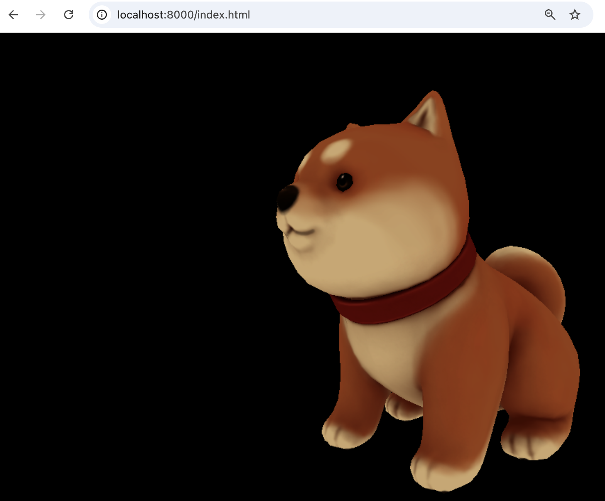
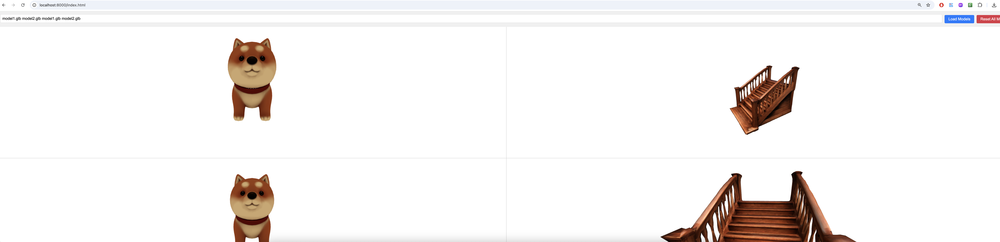

# glb-vis

Simple glb file web visualization.

## View single glb file

```
python3 view_single_glb.py
```




## View multiple glb file

features:
* support multiple glb files view at the same time (at most 4 models)

```
python3 view_multi_glb.py
```



## Future works
* Support GLB Files in AWS S3: Enable direct loading of GLB files from AWS S3 with secure authentication.
* Name Matching: Add intelligent search and filtering based on model names or tags.
* Column Pair-wise Comparison: Enable side-by-side comparison of models with synchronized navigation.
* Support for Other 3D Formats: Expand compatibility to OBJ, FBX, and STL with automatic conversion to GLB.
* Enhanced Viewer Features: Add lighting controls, wireframe mode, annotations, and customizable backgrounds.
* User Authentication: Introduce authentication and role-based access for secure model management.
* API Integration: Integrate with external APIs to fetch and update model metadata.
* Performance Optimization: Optimize model loading and rendering for large or complex files.
* Collaboration Tools: Support shared visualizations, annotations, and report exports.
* Mobile Support: Ensure responsive design and compatibility with mobile devices.
* and more
##  Credit
Credit to ChatGPT